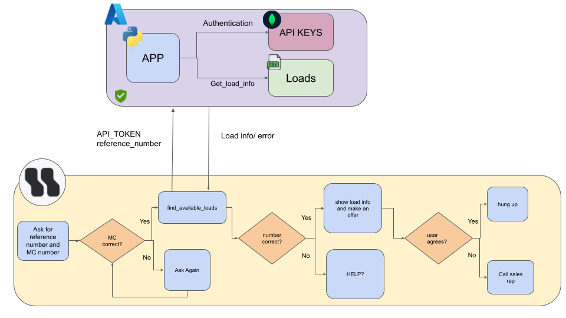

# HR_test




# How to access the API

In this tutorial, you'll learn how to use a Flask API that allows you to retrieve load details from a CSV file, given a reference_number. The API is protected by an API key for authentication, which you will need to include in your request.


## Step 1: Get Your API Key
Before you can start using the API, you need to obtain a valid API key. This key is used to authenticate your requests.

Contact the API provider to request an API key.

The key will be hashed and stored in the database, and you will use it in the Authorization header of your requests.


## Step 2: Making a Request to the API

The endpoint we will interact with is `/loads`. This endpoint allows you to retrieve load details by providing a `reference_number`.

### Request Details:

- **URL**: `https://robothappy-d5e4eyaafhf5dyct.canadacentral-01.azurewebsites.net`
- **Method**: `GET`
- **Authorization Header**: You must include a Bearer token (API key) for authentication.
- **Request Body**: You must send a JSON object containing the `reference_number`.


#### Example using cURL
If you prefer using the command line, you can use cURL to make the API request. Here’s an example:

``` bash 

curl -X GET https://robothappy-d5e4eyaafhf5dyct.canadacentral-01.azurewebsites.net/loads \
     -H "Authorization: Bearer YOUR_API_KEY" \
     -H "Content-Type: application/json" \
     -d '{"reference_number": "12345"}'

```

## Step 3: Understanding the Response
Once you make the request, the API will send a response.

### Success Response:
If the reference_number is valid and the API key is authenticated, you'll get a JSON response with the load details:

- reference_number: Unique identifier for each load.
- origin: The starting location of the load.
- destination: The final destination of the load.
- equipment_type: The type of equipment required (e.g., Dry Van,
Flatbed). 
- rate: The rate associated with the load.
- commodity: The type of goods being transported.

``` json
{   
    "reference_number": "REF09690",
    "origin": "Detroit, MI",
    "destination": "Nashville, TN",
    "equipment_type": "Dry Van",
    "rate": "1495",
    "commodity": "Industrial Equipment"
    
}
```


### Error Responses:
Unauthorized Error: If your API key is invalid or missing, you will get a 401 Unauthorized error:

``` json
{
  "error": "Unauthorized"
}


```
Bad Request: If you don’t include the reference_number or if it’s invalid, you will get a 400 Bad Request error:


``` json
{
  "error": "Reference number is required"
}

```

Not Found: If the load with the specified reference_number does not exist, you will receive a 404 Not Found error:


``` json
{
  "error": "Load not found."
}

```